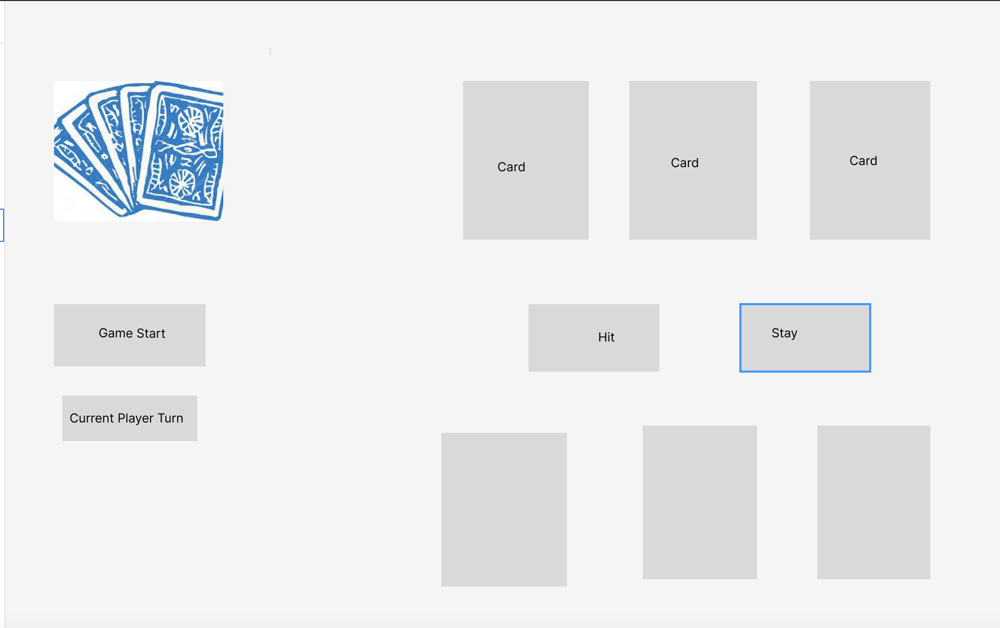

Jack-Black-Jack

Link to game: <a href="https://jjiang9888.github.io/Jack-Black-Jack/">THE GAME</a>

Blackjack is a classic card game where in its most simplest form the objective is to have cards that add up to and not exceeding 21.
In its current form for the sake of MVP, I did not include betting/multiple players/niche blackjack rules like splitting. 

<h2 align="center">Planning Stages-Framework</h2>

     

<h2 align="center">MVP Game Screen</h2>

     

Technologies used: HTML/CSS/JAVASCRIPT , I focused mainly on the javascript because in my opinion that is where the meat of the project code is. 

Future additions: Definitely want to go back and insert betting function and additional players. 